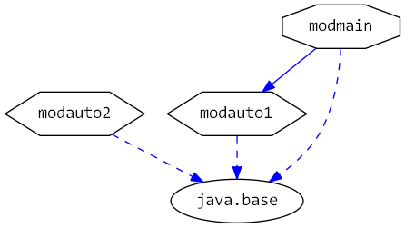

# Java 9 Jigsaw modules example suite
## Example example_splitpackage_automatic-modules

### Info
Written by [Martin Lehmann](https://github.com/MartinLehmann1971), [Kristine Schaal](https://github.com/kristines) and [Rüdiger Grammes](https://github.com/rgrammes) 

see https://github.com/accso/java9-jigsaw-examples

## What is this example about?
This example shows that automatic modules might cause an unwanted and surprising 'split package' problem.

### Modules in this example
- `modmain` is a normal, explicit module, which requires an automatic module `modauto1`
- `modauto1` is a automatic module. It has a package `pkgsplitted`.
- `modauto2` is a automatic module. It has a package `pkgsplitted`, too.

### Module Dependency Graph, created via [DepVis](https://github.com/accso/java9-jigsaw-depvis)

### Example shows ...
As soon as one automatic module `modauto1` is required (by `modmain`), it is added to the runtime configuration.
All works fine, when only the module path `amlib1` with `modauto1` is added to the java launcher's module path, see `run.sh`.

But as soon as we add `amlib2` to the runtime (see `run_with-extended-module-path.sh`) we add `modauto2` to the configuration, though `modmain` does not require it:
Because automatic modules read all other modules, they also read automatically all other automatic modules, so in our example `modauto1` reads `modauto2`.
With that, both `modauto1` and `modauto2` are added to the configuration and as both modules share the same package we this results in a split package problem.

So even though noone (statically) requires `modauto2`, it is automatically required by `modauto1` at runtime and hence causes a runtime error, which might be a bit surprising.
