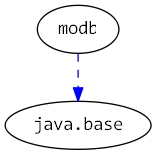

# Java 9 Jigsaw modules example suite
## Example example_unnamed-module_accessing-module-path

### Info
Written by [Martin Lehmann](https://github.com/MartinLehmann1971), [Kristine Schaal](https://github.com/kristines) and [Rüdiger Grammes](https://github.com/rgrammes) 

see https://github.com/accso/java9-jigsaw-examples

## What is this example about?

### Modules in this example
* modb, and also classes for the unnamed module (cpb, cpmain)
* cpmain contains a Main class which are started in run.sh

### Module Dependency Graph, created via [DepVis](https://github.com/accso/java9-jigsaw-depvis)

### Example shows ...
The examples illustrates the accessibility rules access from `Main` class in `cpmain` which are on the classpath (i.e. in the unnamed module). It can access all classes both when ...
  - ... they are in a named module in the explicit module `modb` (but only if the corresponding packages are exported!)
  - ... they are in the unnamed module.
Note that is a class exists both on the classpath and in a module on the module path, the latter is taken. Hence code in a module 'covers' code on the classpath!

The script run.sh starts both the main class `cpmain`.
